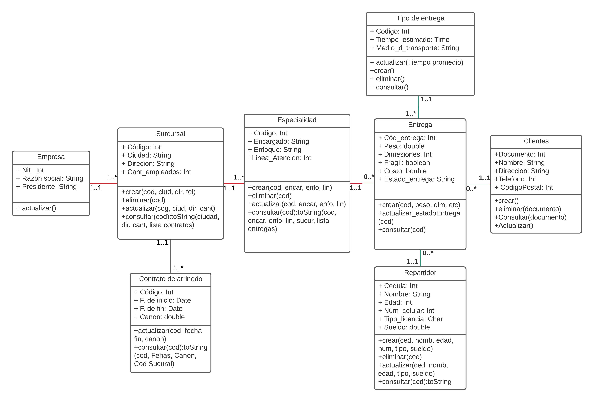

# Data-Structure

In this repository, a java application is created to put into practice the knowledge acquired in the data structure courses at the National University of Colombia-Medellín.

## Integrantes
* Heber Esteban Bermudez Gonzalez  hebermudezg@unal.edu.co
* David Duque Calle daduqueca@unal.edu.co
* intgrante

## Problema

Empresa de entregas o envíos.

Se requiere un software para una empresa, que permita gestionar entregas de mercancía
de diferentes tipos, como lo son: cartas o documentos, medicamentos, alimentos, etc.
La empresa cuenta con varias sucursales en diferentes ciudades cada sucursal tiene una
ubicación, es decir, una ciudad donde se encuentra localizada, su respectiva dirección y una
cantidad de empleados, cada sucursal durante su existencia ha tenido al menos uno o varios
contratos de arrendamientos puesto que la empresa de envió solo arrienda lugares para
montar su sucursal, de estos contratos es importante que el software me permite conocer la
fecha de inicio la fecha de fin y el canon del arriendo.

Una sucursal tiene varias especialidades y estas se especializan en un tipo de
envío diferente (un enfoque) puesto que cada tipo de mercancía tiene sus particularidades y
necesita tratamientos diferentes.

Cada Especialidad hace llegar a los clientes su mercancía mediante envíos, estos envíos están bajo un tipo de entrega particular dependiendo de las particularidades mismas de la mercancía y cada entrega es responsabilidad de un solo repartidor, de la entregar es importante saber código entrega, peso, dimensiones, costo, estado de entrega, que tipo de entrega es, el repartidor responsable y los datos del cliente al que va dirigido.

Los dueños de la empresa quieren hacer análisis estadísticos de los registros de su empresa
por esto es importante conocer los envíos, los clientes, los repartidores, las tarifas, las
sucursales activas y demás información que le permite tener una trazabilidad de su negocio
para consiguientemente poder tomar decisiones estratégicas a futuro.

# Bibliografía
Notas de clase Estrucutra de datos 2020
